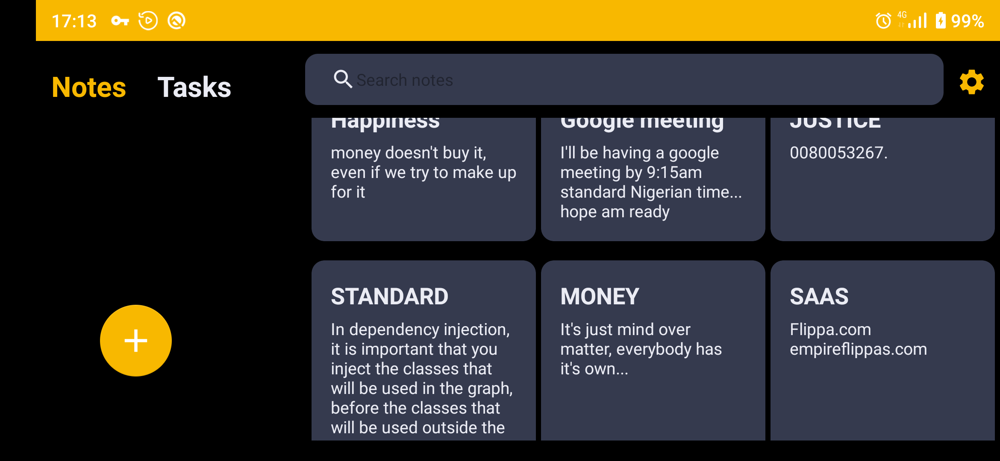
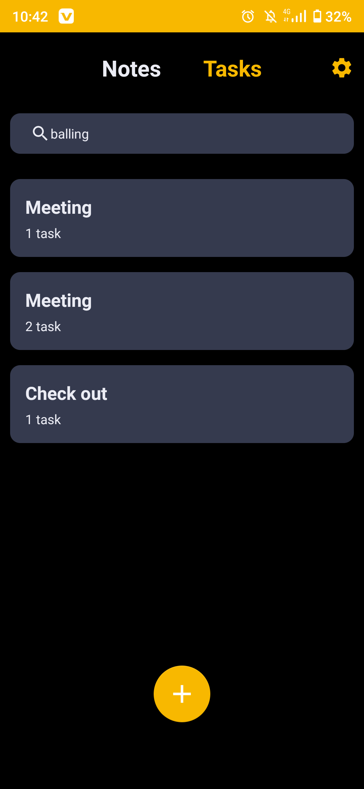
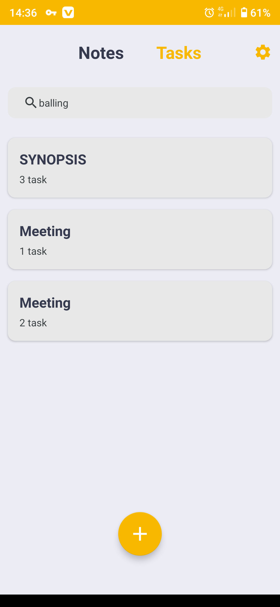
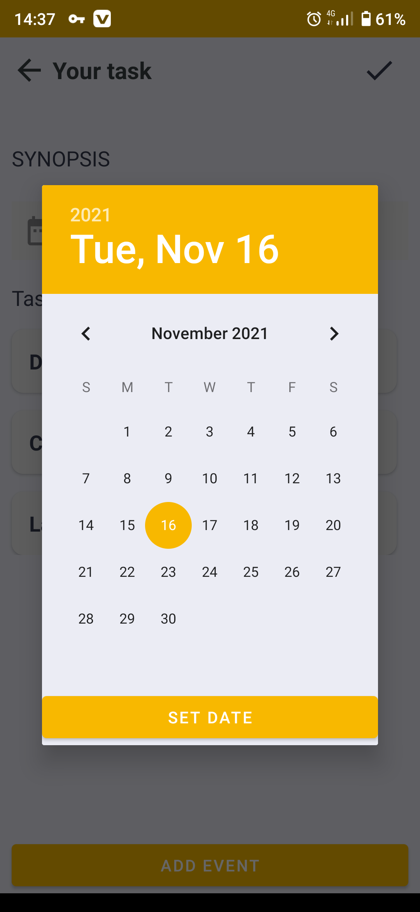
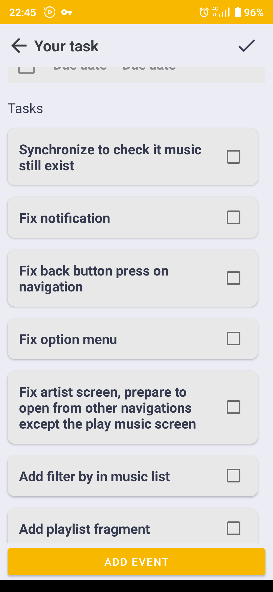

# MVVM-Note-App
This project is a simple note app with clean architecture that uses material ui in android.

Get on playstore- https://play.google.com/store/apps/details?id=com.votenoid.myapplication

# LANDSCAPE MODE

# Potrait
  

